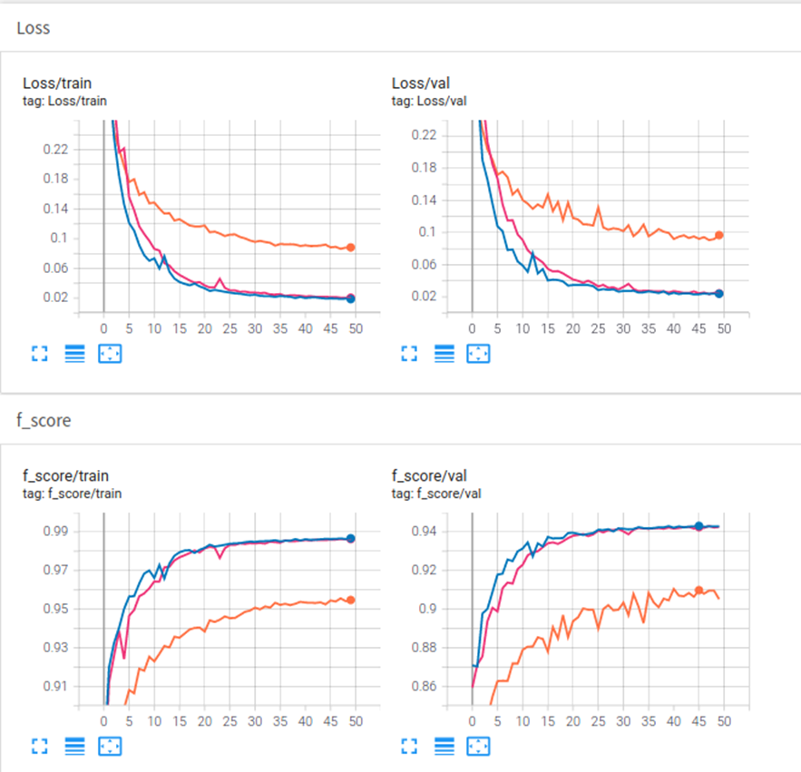

## Semantic Segmentation - Liver Medical Images

## Directory

1.  Required Environment
2.  Dataset
3.  Data Preprocessing
4.  Network Architectures: Unet and Att-Unet
5.  Training Steps
6.  Training Results
7.  Predicting on a Single Image

## Required Environment

torch==1.2.0\
torchvision==0.4.0

## Dataset

1.  Original images are located in "./ganzang_Datasets/Images", totaling 400 images.


2.  Labels are located in "./ganzang_Datasets/Labels", totaling 400 images.


## Data Preprocessing

1.  Before training, run "png2txt.py" to split the dataset into train and validation sets with a ratio of 9:1 (360 images for training and 40 images for validation).
It will generate "trainval.txt", "train.txt", and "val.txt" under "./ganzang_Datasets/ImageSets/Segmentation", containing the filenames of the original image files.

2.  ./until/dataloader_medical.py" preprocesses the dataset.

## Network architectures: Unet and Att-Unet

1.  Running Unet-summary.py, Unet_BN-summary.py, and Att-Unet-summary.py separately will generate summaries of Unet, Unet_BN, and Att-Unet, respectively.
2.  The network architecture and parameters of Att-Unet can be found by opening "AttU-net.txt". Similarly, you can view the network structure and parameters of Unet and Unet_BN by opening "Unet.txt" and "U_Net_bn.txt", respectively.

## Unet

1)  **Principle**：Unet can be divided into three parts:

-   **[Main Feature Extraction]**：The main feature extraction part of Unet is similar to VGG16, consisting of stacks of conv2d and MaxPool2d layers. By using the main feature extraction part, five initial effective feature layers can be obtained. In the next step, these five effective feature layers are utilized for feature fusion.

-   **[Enhanced Feature Extraction]**：Utilizing the five initial effective feature layers obtained in the previous step for upsampling and feature fusion, ultimately obtaining a feature layer that integrates all features.

-   **[Prediction]**：Using the final feature layer that integrates all features, each feature point is classified, equivalent to classifying each pixel.

2)  **Specific code implementation process:**

-   **[Main Feature Extraction]**：Using stacks of conv2d and MaxPool2d layers from VGG16, when the input image size is (512,512,3), the specific implementation is as follows:

     1. Conv1: Perform two 3×3 convolutions with 64 channels, obtaining an initial effective feature layer of (512,512,64), followed by a 2×2 max pooling, resulting in a feature layer of (256,256,64).

     2. Conv2: Perform two 3×3 convolutions with 128 channels, obtaining an initial effective feature layer of (256,256,128), followed by a 2×2 max pooling, resulting in a feature layer of (128,128,128).

     3. Conv3: Perform three 3×3 convolutions with 256 channels, obtaining an initial effective feature layer of (128,128,256), followed by a 2×2 max pooling, resulting in a feature layer of (64,64,256).

     4. Conv4: Perform three 3×3 convolutions with 512 channels, obtaining an initial effective feature layer of (64,64,512), followed by a 2×2 max pooling, resulting in a feature layer of (32,32,512).

     5. Conv5: Perform three 3×3 convolutions with 256 channels, obtaining a feature layer of (32,32,512).


**Main Feature Extraction** The code is as follows, or refer to "./nets/vgg.py".
```
import torch
import torch.nn as nn
from torchvision.models.utils import load_state_dict_from_url

class VGG(nn.Module):
    def __init__(self, features, num_classes=1000):
        super(VGG, self).__init__()
        self.features = features
        self.avgpool = nn.AdaptiveAvgPool2d((7, 7))
        self.classifier = nn.Sequential(
            nn.Linear(512 * 7 * 7, 4096),
            nn.ReLU(True),
            nn.Dropout(),
            nn.Linear(4096, 4096),
            nn.ReLU(True),
            nn.Dropout(),
            nn.Linear(4096, num_classes),
        )
        self._initialize_weights()

    def forward(self, x):
        x = self.features(x)
        x = self.avgpool(x)
        x = torch.flatten(x, 1)
        x = self.classifier(x)
        return x

    def _initialize_weights(self):
        for m in self.modules():
            if isinstance(m, nn.Conv2d):
                nn.init.kaiming_normal_(m.weight, mode='fan_out', nonlinearity='relu')
                if m.bias is not None:
                    nn.init.constant_(m.bias, 0)
            elif isinstance(m, nn.BatchNorm2d):
                nn.init.constant_(m.weight, 1)
                nn.init.constant_(m.bias, 0)
            elif isinstance(m, nn.Linear):
                nn.init.normal_(m.weight, 0, 0.01)
                nn.init.constant_(m.bias, 0)


def make_layers(cfg, batch_norm=False, in_channels = 3):
    layers = []
    for v in cfg:
        if v == 'M':
            layers += [nn.MaxPool2d(kernel_size=2, stride=2)]
        else:
            conv2d = nn.Conv2d(in_channels, v, kernel_size=3, padding=1)
            if batch_norm:
                layers += [conv2d, nn.BatchNorm2d(v), nn.ReLU(inplace=True)]
            else:
                layers += [conv2d, nn.ReLU(inplace=True)]
            in_channels = v
    return nn.Sequential(*layers)
# 512,512,3 -> 512,512,64 -> 256,256,64 -> 256,256,128 -> 128,128,128 -> 128,128,256 -> 64,64,256
# 64,64,512 -> 32,32,512 -> 32,32,512
cfgs = {
    'D': [64, 64, 'M', 128, 128, 'M', 256, 256, 256, 'M', 512, 512, 512, 'M', 512, 512, 512, 'M']
}


def VGG16(pretrained, in_channels, **kwargs):
    model = VGG(make_layers(cfgs["D"], batch_norm = False, in_channels = in_channels), **kwargs)
    if pretrained:
        state_dict = load_state_dict_from_url("https://download.pytorch.org/models/vgg16-397923af.pth", model_dir="./model_data")
        model.load_state_dict(state_dict)
    
    del model.avgpool
    del model.classifier
    return model

```

**Enhanced Feature Extraction：** Using the five initial effective feature layers obtained in the previous step for feature fusion. The fusion method involves upsampling the feature layers and stacking them. Obtain a feature layer of (512,512,64) that integrates all features.


**Prediction**：Utilize a 1×1 convolution for channel adjustment, adjusting the number of channels of the final feature layer to num_classes=2 (liver, background).

**Enhanced Feature Extraction and Prediction** The code can be found in "./nets/unet.py".

## Att-Unet


1)  **Principle**：Att-Unet can be divided into three parts:

-   **[Main Feature Extraction]**：The main feature extraction part of Att-Unet is similar to that of Unet, consisting of stacks of conv2d and MaxPool2d layers, with Batch Normalization added between conv2d and ReLU layers. By utilizing the main feature extraction part, five initial effective feature layers can be obtained. In the next step, these five effective feature layers are used for feature fusion.

-   **[Enhanced Feature Extraction]**：Using the five initial effective feature layers obtained in the previous step for upsampling, then applying the Attention (Att) module between the upsampled feature and the next feature layer not subjected to upsampling. This process generates attention weights assigned to lower-level feature layers, ultimately obtaining a feature layer with attention mechanism applied and integrating all features.

-   **[Prediction]**：Using the final feature layer with attention mechanism applied and integrating all features, each feature point is classified, equivalent to classifying each pixel.


2)  **Specific code implementation process:** The input shape is (1×3×255×255), where 1 is the batch size and 3 is the number of channels. After 5 downsampling operations (up to class AttU_Net's self.Conv5), the feature map has reached its minimum size (1×1024×32×32). Next, the feature map undergoes upsampling using up_conv to obtain self.Up5 (1×512×64×64). Then, the Attention_block is applied to self.Up5 (1×512×64×64) and self.Conv4 (1×512×64×64)., the Attention_block specific implementation is as follows:


     1. Perform a 1x1 convolution on self.Up5 (1×512×64×64) to obtain (1×256×64×64).
   
     2. Perform a 1x1 convolution on self.Conv4 (1×512×64×64) to obtain (1×256×64×64).
   
     3. Add the results of steps 1 and 2.
   
     4. Apply ReLU activation to the result of step 3.
   
     5. Perform a convolution (1x1) on the result of step 4, reducing the number of channels from 256 to 1, obtaining (1×1×64×64).
   
     6. Apply sigmoid activation to ensure the values fall within the range (0,1), where higher values indicate higher attention weights.
   
     7. Multiply the attention weights obtained in step 6 with self.Conv4, assigning the attention weights to lower-level feature layers.


The code for **Att-Unet** can be found in "./nets/attention_unet.py".


## Unet_BN

The difference between the network structure and Att-Unet is that the upsampling part in Att-Unet does not include the attention mechanism (Attention_block).

The code for **Unet_BN** can be found in "./nets/Unet_BN.py".


## Training Steps

-   Execute unet_train_medical.py to start training the U-net model. After each epoch, the model files will be saved in ./logs/U-net.

-   Execute unet_bn_train_medical.py to start training the Unet_BN model. After each epoch, the model files will be saved in ./logs/U-net_bn.

-   Execute Att_train_medical.py to start training the Att-Unet model. After each epoch, the model files will be saved in ./logs/AttU-net.

## Loss Function

1、Cross Entropy Loss is a standard loss function used in classification tasks. When applied in semantic segmentation platforms, it is used in conjunction with Softmax to classify pixels.

2、Dice Loss utilizes the evaluation metric of semantic segmentation as the loss function. The Dice coefficient is a similarity metric commonly used to measure the similarity between two samples, typically employed for calculating the similarity between two segmented regions. Its values range between [0,1].Dice coefficient is computed as the intersection of the predicted and ground truth segmentation masks multiplied by 2, divided by the sum of the predicted and ground truth segmentation masks. Its value ranges from 0 to 1, where a higher value indicates a greater overlap between the predicted and ground truth masks.Since in loss functions, lower values are preferred, Dice Loss is typically defined as 1 minus the Dice coefficient, so that the loss is minimized. Therefore, Dice Loss = 1 - Dice is commonly used as the loss function for semantic segmentation tasks.

## Training Parameters and Strategies

Initial learning rate: 1e-4

Optimizer: Adam

Learning rate adjustment every epoch with a multiplication factor of 0.92

Batch size: 2

Number of epochs: 50

## Performance metrics

1.  f_score：The code for calculating f_score can be found in ./utils/metrics.py.

2.  mIou

3.  mPA

## Training results

1.  'tensorboard --logdir=./runs'



You can view the training and validation loss as well as the training and validation f_score graphs for the Unet model (orange), Unet_BN model (pink), and Att-Unet model (blue).

2.  Executing unet_get_miou_prediction.py, unet_bn_get_miou_prediction.py, and attunet_get_miou_prediction.py will generate 40 pre-segmented validation images (it's okay if they appear as black and white to the naked eye; the predicted class for each pixel is already included) for each model in the directories ./unet_miou_pr_dir, ./unet_bn_miou_pr_dir, and ./attunet_miou_pr_dir, respectively.

3.  After executing unet_miou.py, unet_bn_miou.py, and attunet_miou.py, the mean Intersection over Union (mIoU) and mean Pixel Accuracy (mPA) values for the background and liver in the 40 pre-segmented validation images predicted by each of the three models will be computed.

4.  Before calculating, it's necessary to load the trained models.

-   Modify the `model_path` variable in `unet.py` to load the Unet model.

>     _defaults = {
>         "model_path"        : './logs/U-net/Epoch50-Total_Loss0.0883.pth',
>         "model_image_size"  : (512, 512, 3),
>         "num_classes"       : 2,
>         "cuda"              : True,
>         "blend"             : True
>     }

-   Update the `model_path` variable in `unet_bn.py` to load the Unet_BN model.

>     _defaults = {
>         "model_path"        : './logs/U-net_bn/Epoch50-Total_Loss0.0206.pth',
>         "model_image_size"  : (512, 512, 3),
>         "num_classes"       : 2,
>         "cuda"              : True,
>         "blend"             : True
>     }

-   Modify the `model_path` variable in `Attunet.py` to load the Att_Unet model.

>     _defaults = {
>         "model_path"        : './logs/AttU_Net/Epoch50-Total_Loss0.0187.pth',
>         "model_image_size"  : (512, 512, 3),
>         "num_classes"       : 2,
>         "cuda"              : True,
>         "blend"             : True
>     }

-   Run unet_miou.py to obtain the results.
-   


-   Run unet_bn_miou.py to obtain the results.
-   


-   Run attunet_miou.py to obtain the results.
-   


## Predicting on a Single Image

1.  Before prediction, it is necessary to load the trained model, as mentioned above.
2.  Execute unet_predict.py to obtain the result ./results/unet000.png.
3.  Execute unet_bn_predict.py to obtain the result ./results/unet_bn000.png.
4.  Execute attunet_predict.py to obtain the result ./results/attunet000.png.

From the images below, it can be observed that Att_Unet performs better in segmentation compared to Unet_BN and Unet. Therefore, adding Batch Normalization layers and Attention_block on top of Unet is effective.


