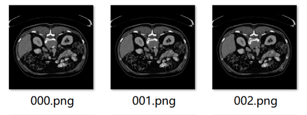
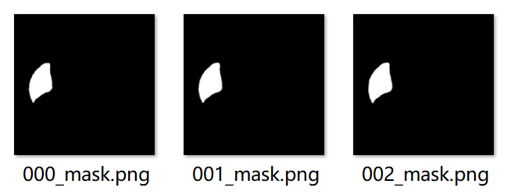
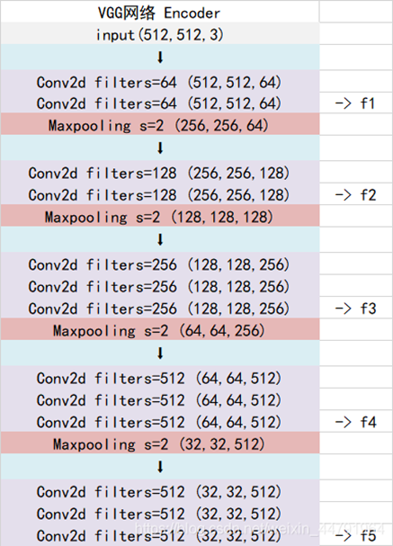
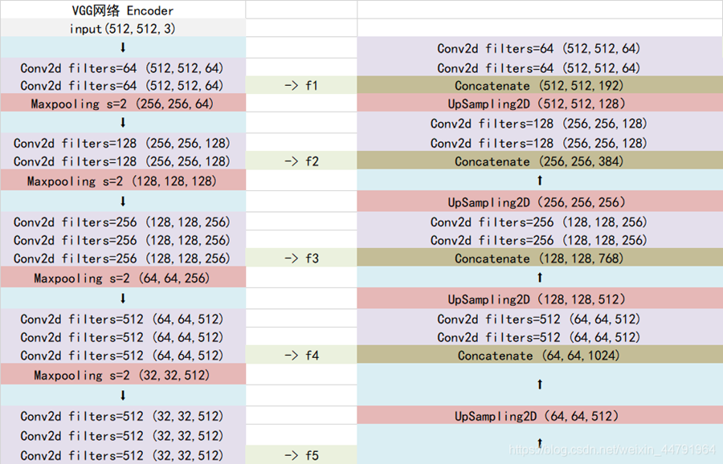
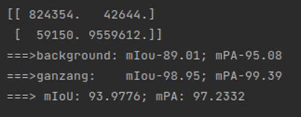
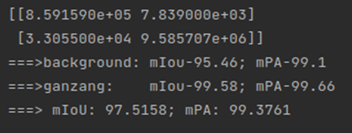
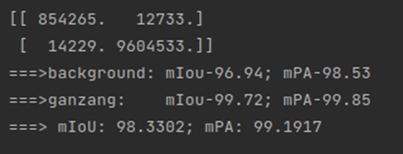
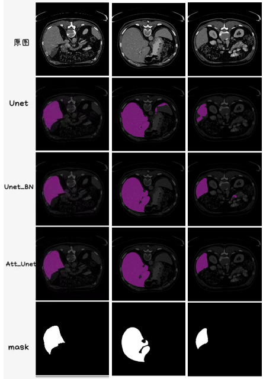

## 语义分割-识别肝脏医学图像

## 目录

1.  [所需环境](#所需环境)
2.  [数据集](#性能情况)
3.  数据预处理
4.  网络结构Unet和Att-Unet
5.  [训练步骤](#预测步骤)
6.  [训练结果](#训练步骤)
7.  单张图片预测

## 所需环境

torch==1.2.0\
torchvision==0.4.0

## 数据集

1.  原图在./ganzang_Datasets/Imags，共400张



2.  标签在 ./ganzang_Datasets/Labels，共400张



## 数据预处理

1.  在训练前运行png2txt.py按照train:val=9:1划分数据集(train360张，val40张)

> 会在./ganzang_Datasets/ImageSets/Segmentation下生成trainval.txt、train.txt、val.txt，里面存放的是原图图片文件名称。

2.  ./until/dataloader_medical.py对数据集进行预处理。

## 网络结构Unet和Att-Unet

> 分别运行Unet-summary.py、Unet_BN-summary.py和Att-Unet-summary.py可以得到Unet、Unet_BN
> 和Att-Unet的网络结构和参数。或者直接打开Unet.txt、U_Net_bn.txt和AttU-net.txt查看网络结构和参数。

1.  Unet

1)  **原理**：Unet可以分为三个部分：

-   **[主干特征提取部分]**：Unet的主干特征提取部分与VGG16类似，为conv2d和MaxPool2d的堆叠。利用主干特征提取部分，可以获得5个初步有效的特征层。在下一步，利用这5个有效特征层进行特征融合。

-   **[加强特征提取部分]**：利用上一步获得的5个初步有效特征层进行上采样，并且进行特征融合，最终得到一个融合所有特征的特征层。

-   **[预测部分]**：利用最终获得的一个融合所有特征的特征层，对每个特征点进行分类，相当于对每一个像素点进行分类。

2)  代码实现：

-   **[主干特征提取部分]**：使用VGG16的conv2d和MaxPool2d进行堆叠，当输入的图像大小为(512,512,3)时，具体实现如下：

> Conv1:进行2次3×3的64通道卷积，获得1个(512,512,64)的初步有效特征层，再进行2×2最大池化，获得1个(256,256,64)的特征层

> Conv2:进行2次3×3的128通道卷积，获得1个(256,256,128)的初步有效特征层，再进行2×2最大池化，获得1个(128,128,128)的特征层

> Conv3:进行3次3×3的256通道卷积，获得1个(128,128,256)的初步有效特征层，再进行2×2最大池化，获得1个(64,64,256)的特征层

> Conv4:进行3次3×3的512通道卷积，获得1个(64,64,512)的初步有效特征层，再进行2×2最大池化，获得1个(32,32,512)的特征层

> Conv5: 进行3次3×3的256通道卷积，获得1个(32,32,512) 的特征层



**主干特征提取部分代码如下：或见./nets/vgg.py**

```
import torch
import torch.nn as nn
from torchvision.models.utils import load_state_dict_from_url

class VGG(nn.Module):
    def __init__(self, features, num_classes=1000):
        super(VGG, self).__init__()
        self.features = features
        self.avgpool = nn.AdaptiveAvgPool2d((7, 7))
        self.classifier = nn.Sequential(
            nn.Linear(512 * 7 * 7, 4096),
            nn.ReLU(True),
            nn.Dropout(),
            nn.Linear(4096, 4096),
            nn.ReLU(True),
            nn.Dropout(),
            nn.Linear(4096, num_classes),
        )
        self._initialize_weights()

    def forward(self, x):
        x = self.features(x)
        x = self.avgpool(x)
        x = torch.flatten(x, 1)
        x = self.classifier(x)
        return x

    def _initialize_weights(self):
        for m in self.modules():
            if isinstance(m, nn.Conv2d):
                nn.init.kaiming_normal_(m.weight, mode='fan_out', nonlinearity='relu')
                if m.bias is not None:
                    nn.init.constant_(m.bias, 0)
            elif isinstance(m, nn.BatchNorm2d):
                nn.init.constant_(m.weight, 1)
                nn.init.constant_(m.bias, 0)
            elif isinstance(m, nn.Linear):
                nn.init.normal_(m.weight, 0, 0.01)
                nn.init.constant_(m.bias, 0)


def make_layers(cfg, batch_norm=False, in_channels = 3):
    layers = []
    for v in cfg:
        if v == 'M':
            layers += [nn.MaxPool2d(kernel_size=2, stride=2)]
        else:
            conv2d = nn.Conv2d(in_channels, v, kernel_size=3, padding=1)
            if batch_norm:
                layers += [conv2d, nn.BatchNorm2d(v), nn.ReLU(inplace=True)]
            else:
                layers += [conv2d, nn.ReLU(inplace=True)]
            in_channels = v
    return nn.Sequential(*layers)
# 512,512,3 -> 512,512,64 -> 256,256,64 -> 256,256,128 -> 128,128,128 -> 128,128,256 -> 64,64,256
# 64,64,512 -> 32,32,512 -> 32,32,512
cfgs = {
    'D': [64, 64, 'M', 128, 128, 'M', 256, 256, 256, 'M', 512, 512, 512, 'M', 512, 512, 512, 'M']
}


def VGG16(pretrained, in_channels, **kwargs):
    model = VGG(make_layers(cfgs["D"], batch_norm = False, in_channels = in_channels), **kwargs)
    if pretrained:
        state_dict = load_state_dict_from_url("https://download.pytorch.org/models/vgg16-397923af.pth", model_dir="./model_data")
        model.load_state_dict(state_dict)
    
    del model.avgpool
    del model.classifier
    return model

```

**[加强特征提取部分]：**利用上一步得到的5个初步的有效特征层进行特征融合，特征融合的方式是对特征层进行上采样，并进行堆叠。获得一个(512,512,64)的融合了所有特征的特征层

-   **[预测部分]**：利用一个1×1卷积进行通道调整，将最终特征层的通道数调整成num_classes=2（肝脏、背景）。

**加强特征提取部分和预测部分的代码见./nets/unet.py**

1.  Att-Unet


1)  **原理**：Att-Unet可以分为三个部分：

-   **[主干特征提取部分]**：Att-Unet的主干提取部分与Unet的主干特征提取部分类似，为conv2d和MaxPool2d的堆叠，并且在conv2d和RELU之间加了Batch
    normalization。利用主干特征提取部分，可以获得5个初步有效的特征层。在下一步，利用这5个有效特征层进行特征融合。

-   **[加强特征提取部分]**：利用上一步获得的5个初步有效特征层进行上采样，然后将上采样结果与下一个未进行上采样的有效特征层执行Att模块，得到注意力权重赋给低层特征层中，最终得到一个加上注意力机制并且融合所有特征的特征层。

-   **[预测部分]**：利用最终获得的一个加上注意力机制并且融合所有特征的特征层，对每个特征点进行分类，相当于对每一个像素点进行分类。



2)  代码实现：

> 输入(1×3×255×255)，1是batchsize,3是channel。经过5次下采样（执行到class
> AttU_Net 的self.Conv5）时，已经是最小的feature
> map(1×1024×32×32)，对其进行上采样up_conv得到self.Up5(1×512×64×64)，然后对self.Up5(1×512×64×64)和self.Conv4(1×512×64×64)执行Attention_block
>
> Attention_block具体执行步骤：

1.  对self.Up5(1×512×64×64)做1×1卷积得到(1×256×64×64)

2.  对 self.Conv4(1×512×64×64)做1×1卷积得到(1×256×64×64)

3.  将①结果和②结果相加

4.  对③结果做relu

5.  对④结果做conv(256×1)卷积，将256通道变为1通道，得到(1×1×64×64)

6.  对⑤结果做sigmod，使得结果落在(0,1)之间，值越大，注意力权重越大。

7.  将⑥得到的注意力权重和self.Conv4相乘，把注意力权重赋给低层特征层。

> **Att-Unet代码见./nets/attention_unet.py**


3、Unet_BN

网络结构与Att-Unet的区别就是上采样部分去掉注意力机制Attention_block

**Unet_BN代码见./nets/Unet_BN.py**


## 训练步骤

-   执行unet_train_medical.py开始训练U-net模型，每训练1个epoch就会在./logs/U-net保存模型文件。

-   执行unet_bn_train_medical.py，开始训练Unet_BN模型，每训练1个epoch就会在./logs/U-net_bn保存模型文件。

-   执行Att_train_medical.py，开始训练Att-Unet模型，每训练1个epoch就会在./logs/AttU-net保存模型文件。

**LOSS函数**

1、Cross Entropy Loss：Cross Entropy
Loss就是普通的交叉熵损失，当语义分割平台利用Softmax对像素点进行分类的时候，进行使用。

2、Dice Loss：Dice
loss将语义分割的评价指标作为Loss，Dice系数是一种集合相似度度量函数，通常用于计算两个样本的相似度，取值范围在\[0,1\]。

计算公式如下：

$\frac{\left( 1 + \beta^{2} \right) \times tp + smooth}{\left( 1 + \beta^{2} \right) \times tp + \beta^{2} \times fn + fp + smooth}$
,$\beta = 1$

就是预测结果和真实结果的交乘上2，除上预测结果加上真实结果。其值在0-1之间。越大表示预测结果和真实结果重合度越大。所以Dice系数是越大越好。作为LOSS的话是越小越好，所以使得Dice
loss = 1 - Dice，就可以将Loss作为语义分割的损失。

**训练参数及策略**

1.  初始学习率：1×10^-4^，优化器Adam，每过1个epoch调整一次学习率，更新学习率的乘法因子为0.92。

2.  Batch_size设置为2，Epoch设置为50轮。

**性能指标**

1.  f_score：同上面的Dice系数。 代码见./utils/metrics.py

$\frac{\left( 1 + \beta^{2} \right) \times tp + smooth}{\left( 1 + \beta^{2} \right) \times tp + \beta^{2} \times fn + fp + smooth}$
,$\beta = 1$

2.  mIou

3.  mPA

## 训练结果

1.  在pycharm的terminal中输入：tensorboard \--logdir=./runs

点开显示的网址，可以看到unet模型（橘黄色）、Unet_BN模型（桃红色）和Att-unet模型（蓝色）的tra_loss、val_loss、tra_f_score、val_f_score图

2.  执行unet_get_miou_prediction.py、unet_bn_get_miou_prediction.py和attunet_get_miou_prediction.py会在./unet_miou_pr_dir、./unet_bn_miou_pr_dir和./attunet_miou_pr_dir文件夹下生成用3个模型分别预测好的40张验证集图片（肉眼看到是黑白的没关系，每个像素点预测的类别已经包含在内）

3.  再执行unet_miou.py、unet_bn_miou.py、attunet_miou.py计算用3个模型分别预测好的40张验证集图片中背景和肝脏的mIou值和mPA值。

> 计算前需要加载训练好的模型

-   Unet模型在unet.py更改model_path

>     _defaults = {
>         "model_path"        : './logs/U-net/Epoch50-Total_Loss0.0883.pth',
>         "model_image_size"  : (512, 512, 3),
>         "num_classes"       : 2,
>         "cuda"              : True,
>         "blend"             : True
>     }

-   Unet_BN模型在unet_bn.py更改model_path

>     _defaults = {
>         "model_path"        : './logs/U-net_bn/Epoch50-Total_Loss0.0206.pth',
>         "model_image_size"  : (512, 512, 3),
>         "num_classes"       : 2,
>         "cuda"              : True,
>         "blend"             : True
>     }

-   Att_Unet模型在Attunet.py更改model_path

>     _defaults = {
>         "model_path"        : './logs/AttU_Net/Epoch50-Total_Loss0.0187.pth',
>         "model_image_size"  : (512, 512, 3),
>         "num_classes"       : 2,
>         "cuda"              : True,
>         "blend"             : True
>     }

-   执行unet_miou.py得到


-   执行unet_bn_miou.py得到


-   执行attunet_miou.py.py得到


## 单张图片预测

1.  预测前同样需要加载训练好的模型，同上
2.  执行unet_predict.py得到./results/unet000.png
3.  执行unet_bn_predict.py得到./results/unet_bn000.png
4.  执行attunet_predict.py得到./results/attunet000.png

下图可以看到，Att_Unet比Unet_BN和Unet的分割效果更好。所以在Unet的基础上，加上Batch
Normalization层和Attention_block是有效的。


